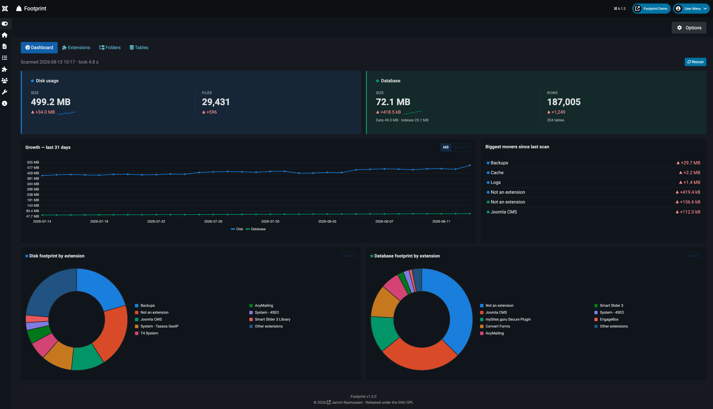

# Footprint

> **See what your Joomla extensions really weigh on your site..!**




## What it does

You just found a **Joomla 6** administrator component that answers a question the CMS never does: \
*Where did all the space go?* 

Footprint puts the `#__extensions` table at the centre and shows, per extension, how much disk **and** how much database it is responsible for.


## Scanning

Scans run in chunks over AJAX with live progress, so a large site never hits `max_execution_time`. Results are cached.

For unattended scans, the component options expose a keyed URL you can paste
into cron:

```
https://example.com/index.php?option=com_footprint&task=cron.run&key=<secret>
```

The key can be regenerated from the component parameters page at any time.


## Usage statistics (opt-in)

You can help develop this component by sending in anonymous usage statistics. It is **off until you say yes**, a *no* is remembered permanently, and the setting lives in *Configuration → Statistics*.

Nothing is sent before consent. When enabled, one request goes out after a scan, at most once every 7 day.

**What is sent**

- A random install id
- Whether the site looks `local`, `private` or `public` — derived from the URL
- Versions: Footprint, Joomla, PHP, database driver and version
- Diagnostic settings only: `debug`, `debug_lang`, `error_reporting`,
  `log_deprecated`, `offline`, `sef`, `caching`, `cache_handler`,
  `session_handler`, `gzip`
- Installed extensions: element, type, version and enabled
- The sizes footprint / measures: filecount, bytes, groups, tables, rowcount, data/index size, scan duration, and the dates of the last three scans

**What is never sent**

Site name, site URL, e-mail addresses, usernames, table names, file paths, and every credential or path from `configuration.php`.


## Requirements

- Joomla 6.x
- PHP 8.3+ (Joomla 6's own minimum)
- MySQL / MariaDB


## Installation

**[⬇ Download the latest release](https://github.com/janich/com_footprint/releases/latest)**

Install the `com_footprint-<version>.zip` through *System → Install → Extensions*,
then open *Components → Footprint*. Every release is listed on the
[releases page](https://github.com/janich/com_footprint/releases).

New versions are announced inside Joomla, under *System → Update → Extensions*,
like any other extension. Installations of 1.0.0 predate the update server and
need one manual update; after that they are notified automatically.


## Building from source

```bash
./build.sh
```

Writes `dist/com_footprint-<version>.zip` with the layout Joomla expects. No
compile step, no dependencies. Pass a version — `./build.sh 1.3.0` — to stamp
one into the package; without it you get a development build.


## Translations

English, Danish, German, Swedish, Norwegian (Bokmål) and Finnish — complete, and shipped inside the component rather than in Joomla's shared language folders.


## Licence

GPL v2 or later. (C) 2026 Janich Rasmussen — <https://github.com/janich/com_footprint>

